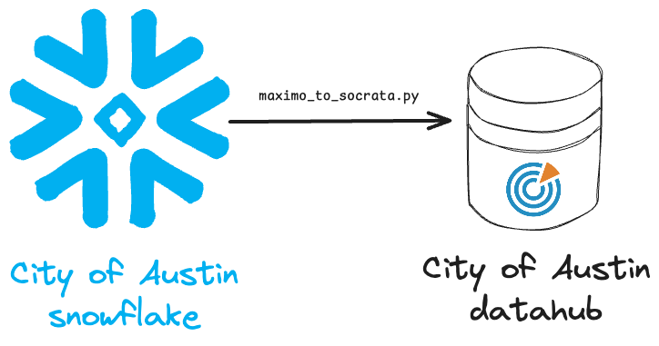

# Maximo Reporting

This repo stores scripts used by the Austin Transportation Public Works Department to access data stored in [Maximo](https://www.ibm.com/products/maximo) and for publishing the data elsewhere.

## maximo_to_socrata.py



This script publishes data from the Maximo data warehouse in Snowflake to the city datahub. This is done to make it easier for city staff to access the data for reporting needs in BI tools such as Power BI.

The three parameters this script takes is `--start`, `--end`, and `--query`, the start and end dates of the work orders to get (based on the record's `CHANGEDATE`). The format of the date passed is quite flexible, so here is an example:

Publishing work orders to the city datahub between August 31st, 2023 and September 9th, 2023:

```bash
python etl/maximo_to_socrata.py --query work_orders --start 2023-08-31 --end 2023-09-09
```
Leaving out `--start` will default to 7 days ago. Leaving out `--end` will default to today. Publishing the work orders for the past week:

```bash
python etl/maximo_to_socrata.py --query work_orders
```

The `--query` determines which query `etl/queries.py` (defined as QUERIES) is run. All queries configured there must take `--start` and `--end` arguments. Queries are written in Snowflake SQL.

### Logging

You can also provide a `-p` or `--progress` flag to the script to see a `tqdm` progress bar. This can be useful for debugging or backfilling a ton of historical data locally.

Example:
```bash
python etl/maximo_to_socrata.py --query work_order_time_logs --start 2026-07-01 -p
```

# Configuration

The script connects to Snowflake using [key-pair authentication](https://docs.snowflake.com/en/user-guide/key-pair-auth) with a service account. All settings are read from environment variables (see `env_template` for the full list).

| Variable | Description |
| --- | --- |
| `SNOWFLAKE_ACCOUNT` | Snowflake account identifier |
| `SNOWFLAKE_USER` | Service account user name |
| `SNOWFLAKE_PRIVATE_KEY` | Full PEM text of the service account's private key, including the `-----BEGIN ...-----` and `-----END ...-----` lines |
| `SNOWFLAKE_PRIVATE_KEY_PASSPHRASE` | Passphrase for the private key, if it is encrypted |
| `SNOWFLAKE_WAREHOUSE` | Warehouse used to run queries |
| `SNOWFLAKE_DATABASE` | Database containing the Maximo data |
| `SNOWFLAKE_SCHEMA` | Schema containing the Maximo data |
| `SNOWFLAKE_ROLE` | Role used for the connection |

Because PEM keys span multiple lines, the key can be provided in either of two forms:

- **Literal `\n` sequences** in place of line breaks, so the key fits on a single line. The script converts these back to real line breaks before parsing.
- **Real line breaks**, as it appears in the key file. In a `.env` file, wrap the value in double quotes. Note that this will not work with Docker's `--env-file`.

# Docker

This repo can be used with a docker container. You can either build it yourself with:

`docker build . -t dts-maximo-reporting:production`

or pull from our dockerhub account:

`docker pull atddocker/dts-maximo-reporting:production`

Then, provide the environment variables described in env_template to the docker image:

`docker run -it --env-file env_file dts-maximo-reporting:production /bin/bash` 

Note that `--env-file` does not support multi-line values, so `SNOWFLAKE_PRIVATE_KEY` must be provided in the single-line form with literal `\n` sequences.

Then, provide the command you would like to run.
