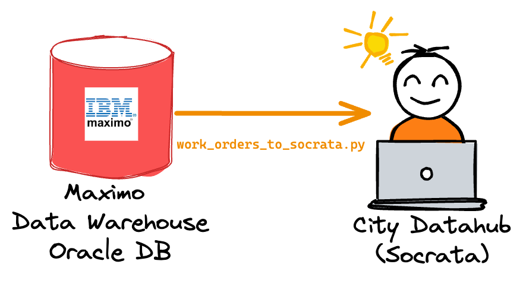

# Maximo Reporting

This repo stores scripts used by the Austin Transportation Public Works Department to access data stored in [Maximo](https://www.ibm.com/products/maximo) and for publishing the data elsewhere.

## maximo_to_socrata.py

This script publishes data from the Maximo data warehouse oracle DB to the city datahub. This is done to make it easier for city staff to access the data for reporting needs in BI tools such as Power BI.

The three parameters this script takes is `--start`, `--end`, and `--query`, the start and end dates of the work orders to get (based on the record's `CHANGEDATE`). The format of the date passed is quite flexible, so here is an example:

Publishing work orders to the city datahub between August 31st, 2023 and September 9th, 2023:

`$ python etl/maximo_to_socrata.py --query work_orders --start 2023-08-31 --end 2023-09-09`

Leaving out `--start` will default to 7 days ago. Leaving out `--end` will default to today. Publishing the work orders for the past week:

`$ python etl/maximo_to_socrata.py --query work_orders`

The `--query` determines which query `etl/queries.py` (defined as QUERIES) is run. All queries configured there must take `--start` and `--end` arguments.  

# Network

Note that you also must be on the City network to be able to access the Maximo data warehouse. Connect to the VPN before running these scripts.

# Docker

This repo can be used with a docker container. You can either build it yourself with:

`$ docker build . -t dts-maximo-reporting:production`

or pull from our dockerhub account:

`$ docker pull atddocker/dts-maximo-reporting:production`

Then, provide the environment variables described in env_template to the docker image:

`$ docker run -it --env-file env_file dts-maximo-reporting:production /bin/bash` 

Then, provide the command you would like to run.